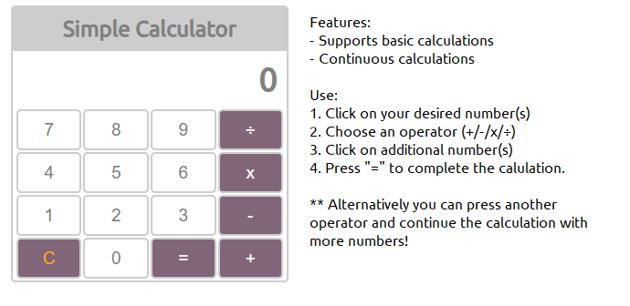

# A Simple Calculator App

### A simple Calculator that offer basic operation

#### Check it out [here](https://btarro.github.io/calculator-app)

## Summary

This app was written using basic HTML, CSS, and JavaScript (no libraries). The focus of this project was to provide a basic calculator that could perform essential operations such as addition, subtraction, multiplication, and division. Additonally, the calculator can perform continuous operation.

In the future I'd like to:

- Simplify the logic/lines of code with a custom parser
- Add memory functionality
- Support advanced operation

## Author

Bruce Tarro - Full Stack Developer [LinkedIn](https://www.linkedin.com/in/bruce-tarro/) | Personal Website - coming soon
